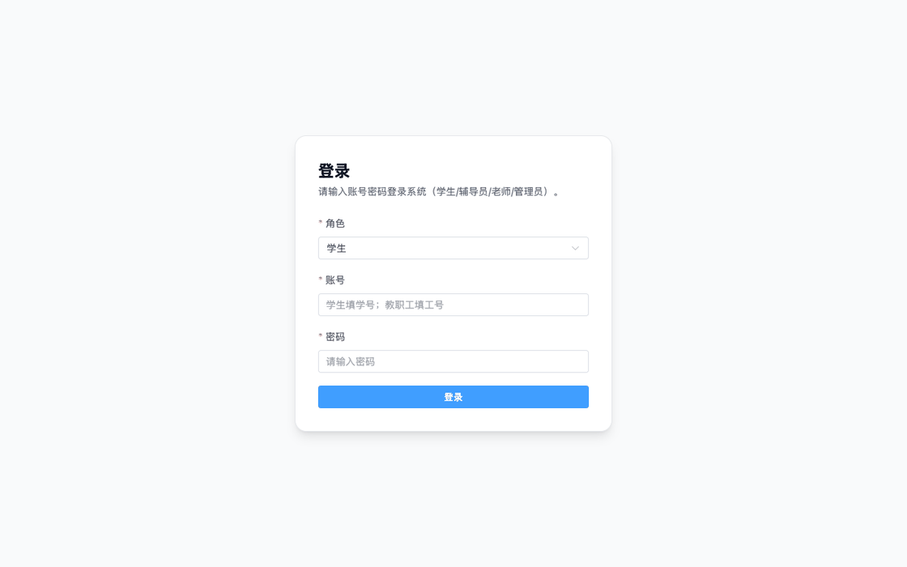
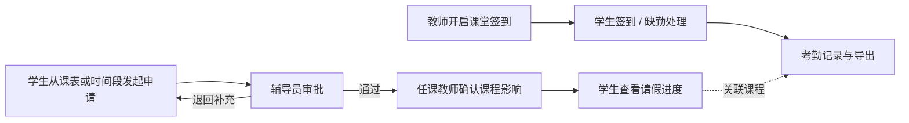
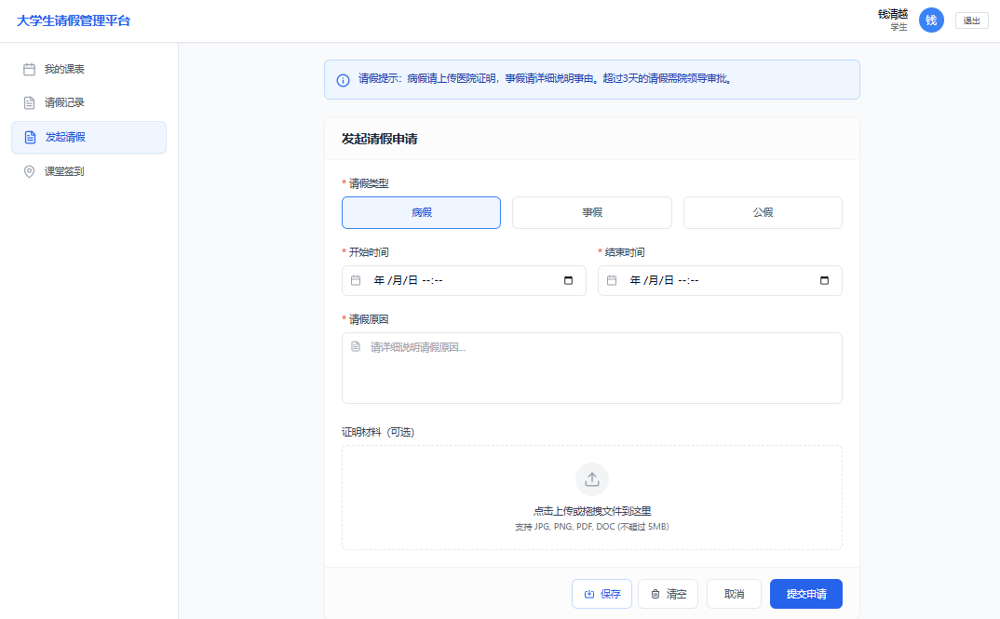
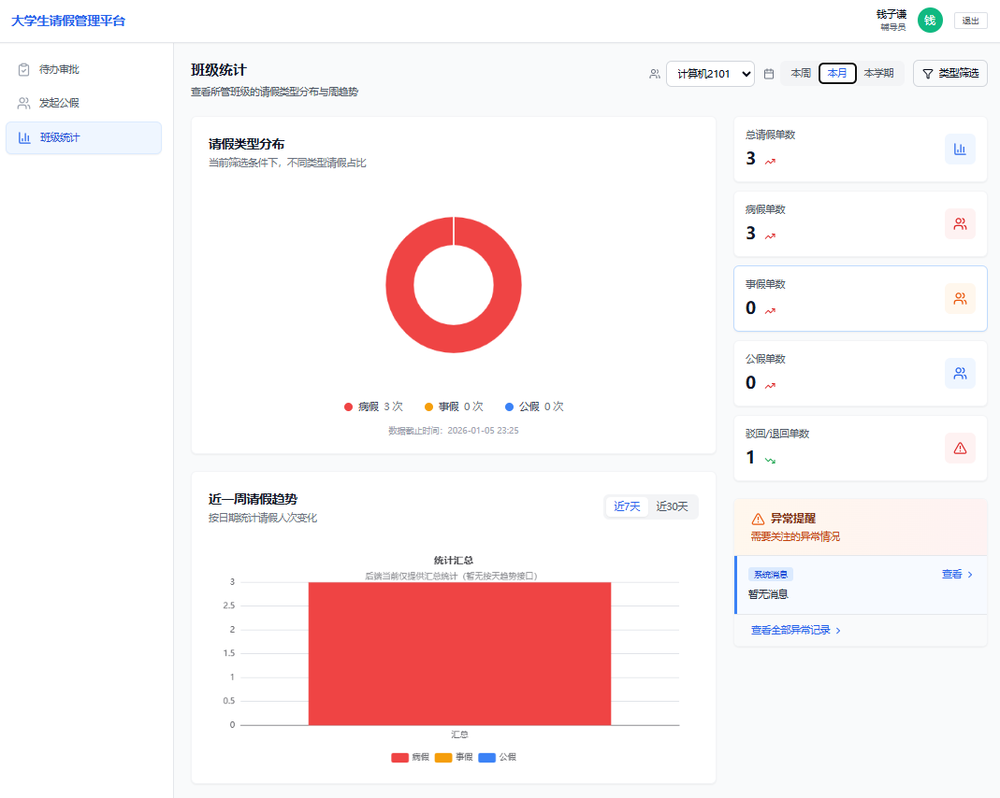
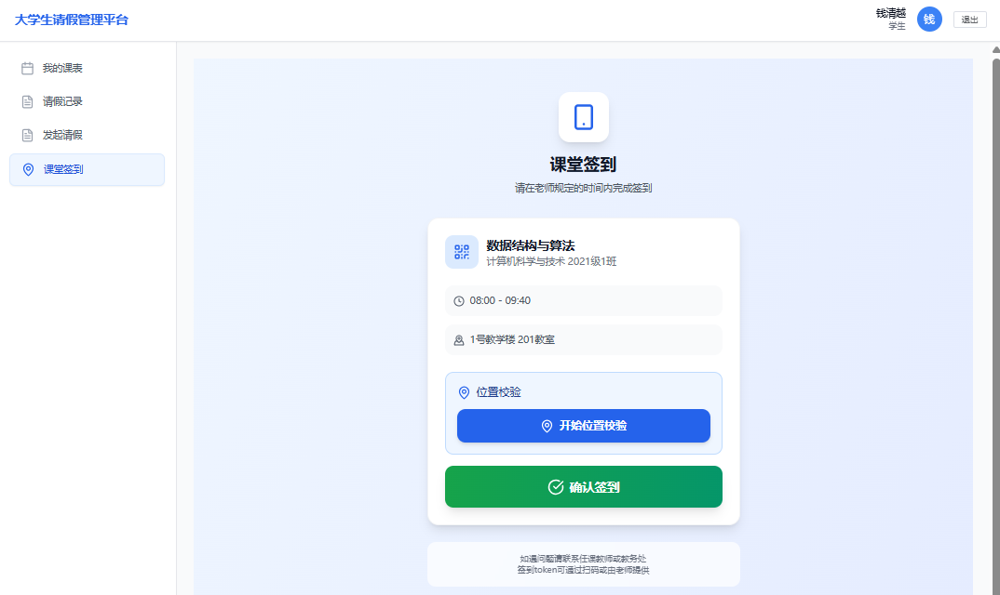
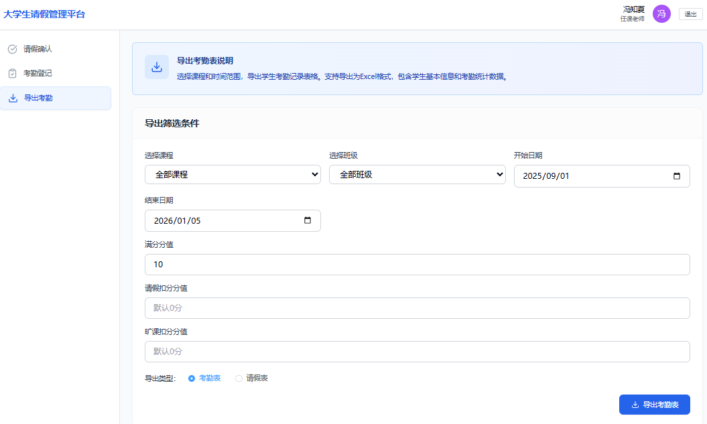
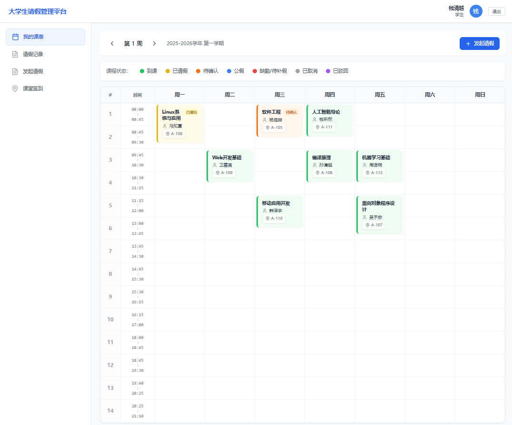
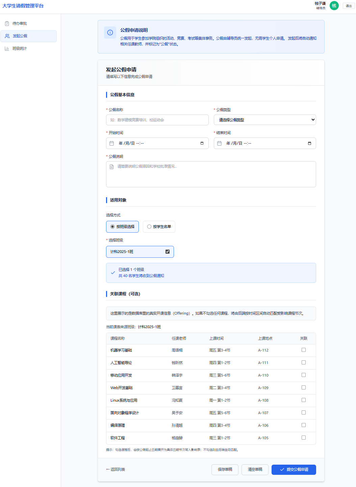
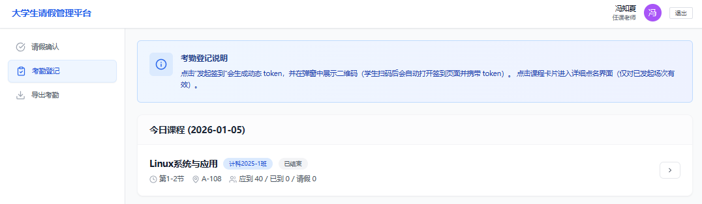
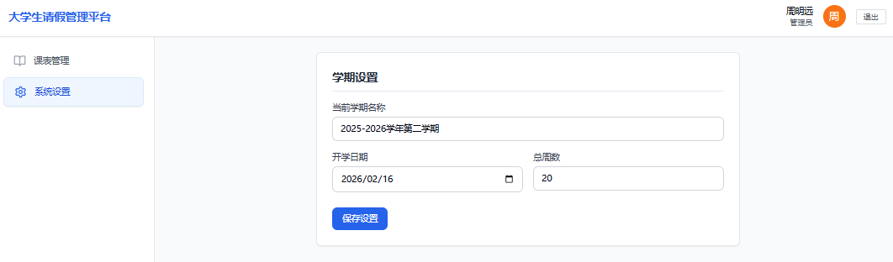

<div align="center">

# 🎓 校假通

### 从课表发起请假，让审批结果回到课堂

面向学生、辅导员、任课教师与管理员的校园请假管理平台。把请假、课程影响、签到和考勤放在同一条业务线上。

<p>
  
  
  
  
</p>

[看交互演示](#真实交互演示) · [了解流程](#一次请假如何流转) · [如何使用](#如何使用) · [快速开始](#快速开始) · [技术架构](#技术架构)

</div>

## 真实交互演示

<p align="center">
  
  <br>
  <sub>学生登录 → 课表选课 → 填写事假 → 提交 → 查看请假记录与详情</sub>
</p>

GIF 使用仓库里的 **Vue 前端实际运行**并按真实点击流程截帧。录制环境没有 Java 和 MySQL，登录、课表与请假接口使用本地模拟响应，账号和课程均为演示数据；这段动图展示的是前端交互，**不代表后端联调或数据库写入结果**。下方多角色截图另取自仓库项目报告。

## 一次请假如何流转

校假通的起点是学生的课表。学生可以针对某节课程发起请假，也可以按时间段申请；系统把申请与受影响课程关联，让审批人和任课教师知道这张请假单影响了哪堂课。



| 使用者 | 打开系统后关心什么 | 对应操作 |
| :--- | :--- | :--- |
| **学生** | 这周有什么课？请假批到哪一步？ | 查看课表与请假状态；提交病假、事假或公假，上传凭证；查看、补充或重提交申请；参与课堂签到 |
| **辅导员** | 哪些申请待处理？班级请假情况如何？ | 筛选、批量审批或退回请假单；按班级发起公假；查看班级统计 |
| **任课教师** | 哪些学生请假影响我的课？谁到了课堂？ | 确认课程影响；开启签到、处理缺勤；按课程、班级和日期导出考勤 |
| **管理员** | 本学期的基础教务数据是否齐全？ | 维护学期设置与课表导入；通过管理接口维护班级、课程、开课和选课数据 |

## 如何使用

**学生体验路径**：用初始化数据中的学生账号登录 → 打开「我的课表」选择课程 → 点击「发起请假」填写类型、原因和必要凭证 → 在「请假记录」查看审批进度与详情。若申请被退回，可按提示补充后重新提交。

**审批与教学路径**：辅导员从待办列表处理申请；任课教师在请假确认页确认受影响课程，并在上课时创建签到会话。需要复盘时，到考勤页按课程、班级或日期筛选与导出。

本地启动步骤和演示账号见[快速开始](#-快速开始)。初始化脚本提供学生账号；教职工演示账号需要先在本地数据库设置密码，管理员账号需要自行配置。

## 更多真实界面

以下静态截图提取自仓库的 [《校假通项目报告》](./校假通项目报告.pdf) 第 12–18 页，展示报告中的演示界面与示例数据；它们与上方本次运行录制的 GIF 来源不同。

| 学生 · 请假申请 | 辅导员 · 班级统计 |
| :---: | :---: |
| <a href="./docs/images/student-leave-apply.png"></a> | <a href="./docs/images/counselor-statistics.png"></a> |
| 填写请假信息与证明材料 | 查看请假类型分布与近期趋势 |

| 学生 · 课堂签到 | 教师 · 导出考勤 |
| :---: | :---: |
| <a href="./docs/images/student-checkin.png"></a> | <a href="./docs/images/teacher-export.png"></a> |
| 查看签到状态与记录 | 筛选课程、班级和日期并导出 |

<details>
<summary><strong>展开更多页面：课表、公假、考勤登记与系统设置</strong></summary>

<p align="center"><a href="./docs/images/student-timetable.png"></a><br><sub>学生 · 课表与请假状态</sub></p>

| 辅导员 · 发起公假 | 教师 · 考勤登记 | 管理员 · 系统设置 |
| :---: | :---: | :---: |
| <a href="./docs/images/counselor-public-leave.png"></a> | <a href="./docs/images/teacher-attendance.png"></a> | <a href="./docs/images/admin-settings.png"></a> |

</details>

> [!NOTE]
> 仓库的需求文档与项目报告包含规划内容；功能、接口和运行说明以当前代码为准。

## 技术架构

| 层次 | 技术 |
| :--- | :--- |
| 前端 | Vue 3、TypeScript、Vite 7、Vue Router、Pinia、Element Plus、Tailwind CSS、ECharts |
| 后端 | Java 17、Spring Boot 4.0.0、Spring Web MVC、MyBatis、Apache POI |
| 数据 | MySQL 8；仓库提供数据库初始化 SQL |
| 测试 | JUnit、MockMvc；`backend/TestCase/` 提供 HTTP 调试用例 |

```text
浏览器 / Vue 3 + Vite
          │  /api、/admin
          ▼
Spring Boot Controller → Service → MyBatis Mapper → MySQL
```

项目主要目录：

```text
.
├── frontend/
│   ├── src/views/              # 四类角色的页面
│   ├── src/api/                # 前端请求封装
│   ├── src/router/             # 页面路由与登录守卫
│   └── vite.config.ts          # 开发代理
├── backend/
│   ├── src/main/java/com/example/leavesystem/
│   │   ├── controller/         # REST 接口
│   │   ├── service/            # 业务逻辑
│   │   ├── mapper/             # 数据访问
│   │   └── security/           # Token 与角色校验
│   ├── src/main/resources/
│   │   ├── application.properties
│   │   └── leave_system_database.sql
│   └── src/test/               # 后端测试
├── docs/images/               # 运行 GIF 与项目报告截图
├── 大学生请假信息管理平台需求文档.pdf
└── 校假通项目报告.pdf
```

## 快速开始

### 1. 准备环境

- **JDK 17+**
- **Maven**（确保 `mvn` 命令可用）
- **MySQL 8.0+**（初始化脚本使用 MySQL 8 的排序规则）
- **Node.js 20.19+（20.x）或 22.12+** 与 npm

```bash
git clone https://github.com/dmh045/Campus-Leave-Management-Platform.git
cd Campus-Leave-Management-Platform
```

### 2. 初始化数据库

先创建一个新的本地数据库，再导入仓库提供的 SQL：

```bash
mysql -u root -p -e "CREATE DATABASE leave_system CHARACTER SET utf8mb4 COLLATE utf8mb4_0900_ai_ci;"
mysql -u root -p leave_system < backend/src/main/resources/leave_system_database.sql
```

> [!IMPORTANT]
> 初始化脚本包含 `DROP TABLE IF EXISTS`。请使用新的开发数据库，不要导入到已有业务数据的数据库中。

打开 [`backend/src/main/resources/application.properties`](./backend/src/main/resources/application.properties)，把数据库用户名、密码和连接地址改成你本机的值。仓库自带的是本地开发配置；不要把个人数据库密码提交到公开仓库。

```properties
spring.datasource.username=YOUR_MYSQL_USER
spring.datasource.password=YOUR_MYSQL_PASSWORD
```

### 3. 启动后端

在一个终端中运行：

```bash
cd backend
mvn spring-boot:run
```

Windows PowerShell 同样使用 `mvn spring-boot:run`。仓库未提交 Maven Wrapper 所需的 `.mvn/wrapper` 配置，因此应使用本机安装的 Maven。后端默认监听 [http://localhost:8080](http://localhost:8080)。

### 4. 启动前端

在另一个终端中，从仓库根目录运行：

```bash
cd frontend
npm ci
npm run dev
```

打开 Vite 输出的本地地址，默认是 [http://localhost:5173](http://localhost:5173)。开发服务器已将 `/api` 和 `/admin` 代理至 `http://localhost:8080`，因此要同时启动前后端。

### 5. 使用演示账号

初始化数据包含两个学生账号：

| 角色 | 登录类型 | 账号 | 初始密码 |
| :--- | :--- | :--- | :--- |
| 学生 | `STUDENT` | `20210001` | `123456` |
| 学生 | `STUDENT` | `20210002` | `123456` |

初始化脚本还包含辅导员工号 `T2024001` 和任课教师工号 `T2024002`，但两人的 `staff.password` 初始为 `NULL`。仅在本地演示数据库中设置测试密码后，选择 `STAFF` 类型登录：

```sql
UPDATE staff
SET password = 'change-me-for-local-demo'
WHERE staff_no IN ('T2024001', 'T2024002');
```

管理员账号 **没有** 随初始化数据创建；需要自行准备教职工账号并赋予 `ADMIN` 角色。以上账号和明文密码仅用于本地演示，不适合生产环境。

## 接口速览

登录成功后，受保护的接口使用 `Authorization: Bearer <token>`。前端通过 Axios 请求拦截器自动携带令牌；服务端根据用户角色限制操作。

| 业务 | 代表性接口 |
| :--- | :--- |
| 认证 | `POST /api/auth/login`、`POST /api/auth/logout` |
| 学生请假 | `POST /api/leaves/apply`、`GET /api/leaves/my`、`GET /api/leaves/{id}/detail`、`PUT /api/leaves/{id}/resubmit` |
| 辅导员审批 | `GET /api/leaves/pending/counselor`、`POST /api/leaves/{id}/counselor-approve`、`POST /api/leaves/counselor-approve/batch`、`POST /api/leaves/public/batch` |
| 教师确认 | `GET /api/leaves/pending/teacher`、`POST /api/leaves/impact/{impactId}/teacher-confirm` |
| 课表与统计 | `GET /api/timetable/student/day`、`GET /api/timetable/teacher/day`、`GET /api/stats/class-leave` |
| 课堂考勤 | `POST /api/attendance/session/start`、`POST /api/attendance/checkin`、`GET /api/attendance/session/{sessionId}/detail`、`GET /api/teacher/attendance/export` |
| 基础数据 | `/admin/terms`、`/admin/classes`、`/admin/courses`、`/admin/offerings`、`/admin/enrollments` |

登录请求示例：

```json
{
  "loginType": "STUDENT",
  "username": "20210001",
  "password": "123456"
}
```

教职工登录时将 `loginType` 改为 `STAFF`。各接口的参数及返回结构以 [后端 Controller](./backend/src/main/java/com/example/leavesystem/controller) 和 [前端 API 封装](./frontend/src/api) 为准。

## 构建与检查

在数据库已初始化且连接配置可用的情况下，运行后端测试：

```bash
cd backend
mvn test
```

构建前端：

```bash
cd frontend
npm ci
npm run build
```

后端打包命令为 `cd backend && mvn clean package`；生成的 JAR 位于 `backend/target/`。手动调试请求可参考 [`backend/TestCase/scratch.http`](./backend/TestCase/scratch.http)。

## 常见问题

<details>
<summary><strong>前端接口返回 404 或连接失败</strong></summary>

确认后端运行在 `8080`，并通过 Vite 开发服务访问前端。`frontend/vite.config.ts` 的代理仅在开发服务中生效；单独部署前端构建产物时需要自行配置反向代理。

</details>

<details>
<summary><strong>辅导员或任课教师无法登录</strong></summary>

检查本地数据库中的 `staff.password`：初始化 SQL 为这两个账号写入 `NULL`，必须先设置演示密码。

</details>

<details>
<summary><strong>管理员页面无法使用</strong></summary>

初始化数据没有管理员账号。需要准备可登录的教职工账号，并在 `staff_role` 中配置 `ADMIN`；管理接口也会在后端校验角色。

</details>

## 项目文档

- [大学生请假信息管理平台需求文档](./大学生请假信息管理平台需求文档.pdf)：需求与业务场景
- [校假通项目报告](./校假通项目报告.pdf)：流程、建模、系统界面与部署说明
- [测试案例](./测试案例.xlsx)：测试用例表
- [HTTP 调试用例](./backend/TestCase/scratch.http)：接口请求示例

---

<p align="center"><sub>Campus Leave Management Platform · 校假通</sub></p>
